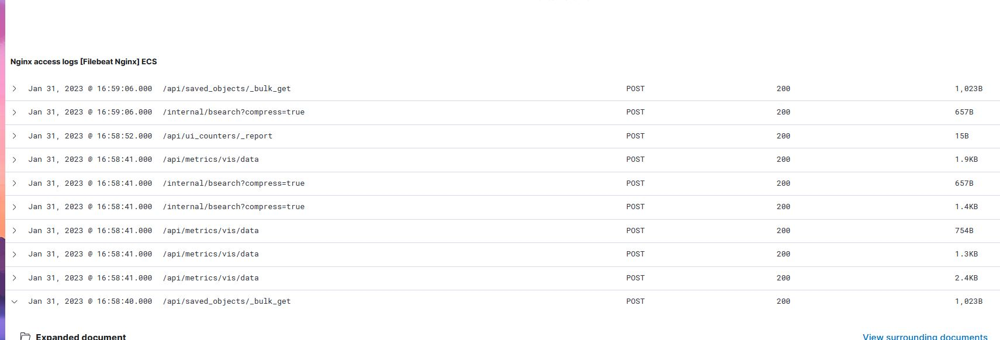

# Proyecto de instalaccion de stack ELK y servidor WordPress

Este proyecto se realizó en una infraestructura virtual montada con VirtualBox.     
El sistema operativo utilizado es Ubuntu  

      
### infra y networking:
Para el proyecto usamos 2 servidores con las siguientes ip estaticas (  [__paso a paso en este link__](./src/staticip.md) ) 

    192.168.2.30 - Wordpress
    192.168.2.8  - ELK STACK
       
Para poder acceder vía SSH a estos servers desde el Host configuramos port forwarding en la VBOX:

## A - Diagrama de la infraestructura implementada

  

## Montar maquinas virtuales con VBox

Generamos 2 maquinas virtuales conectadas a una red NAT de forma que puedan comunicarse entre si, a la misma se le dio un rango 192.168.2.0/24

## Paso 1 
## instalacion y configuracion del servidor Wordpress 

Ver [Documentacion para la instalacion y configuracion del Servidor Wordpress](./src/3-instalacionWP.md)

los pasos a seguir serán automatizados en un script de instalación y configuracion del servidor

## Paso 2
## Instalación host del stack ELK

Ver [Documentacion para la instalacion y configuracion del Servidor con stack ELK](./src/4-instalacionELK.md)

los pasos a seguir serán automatizados en un script de instalación y configuracion del servidor

# Utilizar script para la instalacion automatizada

Para utilizar los scripts para la instalacion automatizada de los proyectos se deben seguir los siguientes pasos:
1. clonar el repositorio
2. ejecutar los script con permisos de root
3. para la instalacion del servidor wordpress ejecutar el comando ./Wordpress.sh
4. para la instalacion del servidor ELK ejecutar el comando ./ELK.sh
5. se debe terminar la configuracion de wordpress y kibana a traves de sus consolas web

## Evidencias de la obtención de eventos registrados en los logs de la aplicación en Kibana
  
  

## Análisis de rendimiento de los servidores con herramientas de CLI y/o Vector. ¿Alguno necesita más recursos o está sobredimensionado?

Podemos ver que los servidores estan sobredimencionados de momento, estando sobrados de capacidad de procesamiento, RAM y almacenamiento pero al no tener un marco de uso real no se puede decir cuales son los requirimientos productivos.
Para el caso de prueba se podría reducir sobretodo en almacenamiento y memoria RAM

## Propuestas para mejorar la escalabilidad y disponibilidad (HA)

Se podría desplegar una infraestructura de alta disponiblidad mediante 3 nodos y un load balancer para ambos servidores.
Tambien se puede simplificar el despliegue mediante el uso de Servicios cloud y contenedores